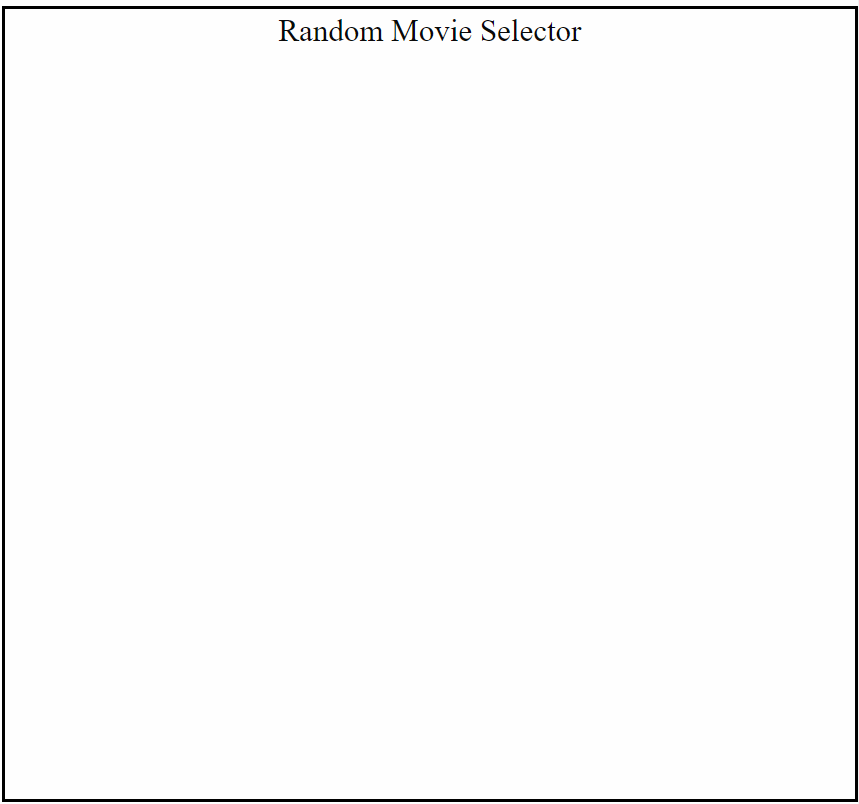
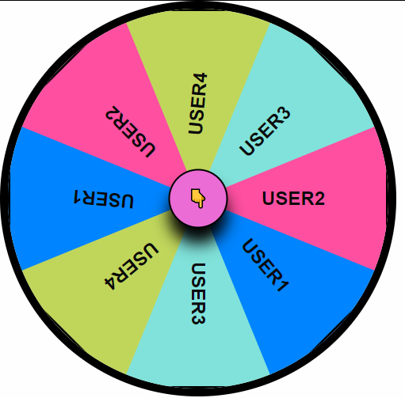

# Lets-Settle-It
Conflict Resolution App for indecisive people.
<!-- In progress -->

<em>Description</em>  
Let's Settle It Conflict Resolution App is an application for the usage of randomly selecting the thing which you would like to do. Specifically, current development includes options for movie selection, activity selection and a custom input in which you can have the app select between options you yourself have chosen.

<em>Usage</em>  
So imagine this, you and your significant other are in a conversation and you both know that you want to go out and do something. But you can't agree on where to go, or maybe you both want to get some Netflix and Chill going on but you can't decide on a movie. Look no further, by using this app's random selector, you'll be able to quickly select a movie by genre and year range then put that movie on and get to the good stuff. This is accomplished by:

Use of the OMDB API to randomly select a movie from their entire database:  
You can see results displayed by Title.  
You can see results displayed by Runtime. 
You can see results displayed by Movie Poster.  
You can see results displayed by Description.    

Or you can  insert a custom input to spin the Wheel of Destiny.
   

<em>Main Squeeze:</em>
The main idea behind this application is offering you a decision when you can't make one. This idea is so versatile future development could include a plethora of options. But at the base level it is a random selector. It has many facets, for example, resolving a couple's conversation about where to eat, or when the boys get together and can't decide which club to go to. 

So before you get all up in arms about how great and versatile our app is. Let's Settle It!

Credits
Creators:

Keith Murphy  
A.C. Kimari  
Simran Kaur  
Jared Rose  

API's used:  
OMDB API  
TMDB API